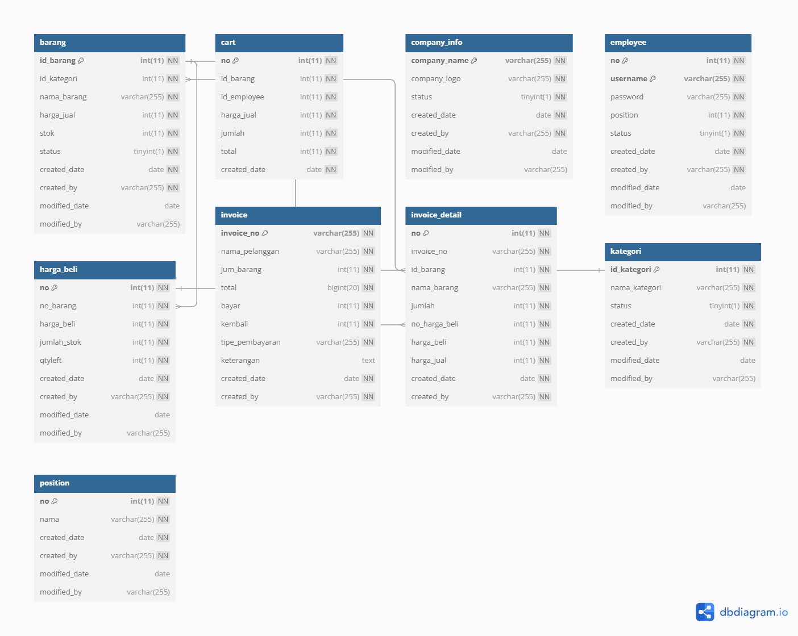

# Design Document

By Wahyudi Robby Sutanto

Video overview: <URL HERE>

## Scope

The database for CS50 SQL includes all entities necessary to facilitate the process of tracking student progress and leaving feedback on student work. As such, included in the database's scope is:

* barang, including basic identifying information
* harga_beli, including the buying price of product inside table barang
* company_info, including basic identifying information
* employee, including basic identifying information
* kategori, including basic identifying information
* position, including basic identifying information
* cart, including content for invoice when submitted
* invoice, which includes basic information about the product that sold
* invoice_detail, which includes detail information about the product that sold that linked to invoice

## Functional Requirements

This database will support:

* CRUD operations for inserting the product, its buying and selling price.
* CRUD operations for update the company_info.
* CRUD operations for inserting or updating employee.
* CRUD operations for inserting or updating kategori.
* CRUD operations for inserting or updating cart. And after that inserting to invoice.
* See history and make report from invoice and invoice_detail

## Representation

Entities are captured in MySQL tables with the following schema.

### Entities

The database includes the following entities:

#### barang

the `barang` table includes:

* `id_barang` which specifies the unique ID for the barang as an `INTEGER`. This column thus has the `PRIMARY KEY` constraint applied.
* `id_kategori` which specifies the ID from `kategori` table as an `INTEGER`. This column thus has the `FOREIGN KEY` constraint applied.
* `nama_barang` which specifies the barang's name as `VARCHAR`, given `VARCHAR` is appropriate for name fields.
* `harga_jual` which specifies the barang's selling price as `INT`, given `INT` is appropriate for the price fields.
* `stok` which specifies the barang's stock as `INT`, given `INT` is appropriate for the stock fields.
* `status` which specifies the barang's status as `TINYINT`, given `TINYINT` is appropriate for the status fields which got default value as `1`.
* `created_date` which specifies record's created date as `DATE`, given `DATE` is appropriate for the created date fields which got default `(current_timestamp)`,
* `created_by` which specifies the record's created by as `VARCHAR`, given `VARCHAR` is appropriate for created by fields.
* `modified_date` which specifies record's modified date as `DATE`, given `DATE` is appropriate for the modified date fields which got default `(current_timestamp)`,
* `modified_by` which specifies the record's modified by as `VARCHAR`, given `VARCHAR` is appropriate for modified by fields.

#### cart

the `cart` table includes:

* `no` which specifies the unique ID for the cart as an `INTEGER`. This column thus has the `PRIMARY KEY` constraint applied.
* `id_barang` which specifies the ID from `barang` table as an `INTEGER`. This column thus has the `FOREIGN KEY` constraint applied.
* `id_employee` which specifies the ID from `employee` table as an `INTEGER`. This column thus has the `FOREIGN KEY` constraint applied.
* `harga_jual` which got the value of the barang's selling price as `INT`, given `INT` is appropriate for the price fields.
* `jumlah` which specifies the cart's qty as `INT`, given `INT` is appropriate for the qty fields.
* `total` which specifies the cart's total qty as `INT`, given `INT` is appropriate for the total qty fields.
* `created_date` which specifies record's created date as `DATE`, given `DATE` is appropriate for the created date fields which got default `(current_timestamp)`.

#### company_info

the `company_info` table includes:

* `company_name` which specifies the company_info's name as `VARCHAR`, given `VARCHAR` is appropriate for name fields.
* `company_logo` which specifies the company_info's path for logo image as `VARCHAR`, given `VARCHAR` is appropriate for name fields.
* `status` which specifies the company_info's selling price as `TINYINT`, given `TINYINT` is appropriate for the status fields which got default value as `1`.
* `created_date` which specifies record's created date as `DATE`, given `DATE` is appropriate for the created date fields which got default `(current_timestamp)`,
* `created_by` which specifies the record's created by as `VARCHAR`, given `VARCHAR` is appropriate for created by fields.
* `modified_date` which specifies record's modified date as `DATE`, given `DATE` is appropriate for the modified date fields which got default `(current_timestamp)`,
* `modified_by` which specifies the record's modified by as `VARCHAR`, given `VARCHAR` is appropriate for modified by fields.

#### employee
the `employee` table includes:

* `no` which specifies the unique ID for the employee as an `INTEGER`. This column thus has the `PRIMARY KEY` constraint applied.
* `username` which specifies the employee's username as `VARCHAR`, given `VARCHAR` is appropriate for username fields.
* `password` which specifies the employee's password as `VARCHAR`, given `VARCHAR` is appropriate for password fields.
* `position` which specifies the ID from `position` table as an `INTEGER`.
* `status` which specifies the employee's status as `TINYINT`, given `TINYINT` is appropriate for the status fields which got default value as `1`.
* `created_date` which specifies record's created date as `DATE`, given `DATE` is appropriate for the created date fields which got default `(current_timestamp)`,
* `created_by` which specifies the record's created by as `VARCHAR`, given `VARCHAR` is appropriate for created by fields.
* `modified_date` which specifies record's modified date as `DATE`, given `DATE` is appropriate for the modified date fields which got default `(current_timestamp)`,
* `modified_by` which specifies the record's modified by as `VARCHAR`, given `VARCHAR` is appropriate for modified by fields.

#### harga_beli

the `harga_beli` table includes:

* `no` which specifies the unique ID for the harga_beli as an `INTEGER`. This column thus has the `PRIMARY KEY` constraint applied.
* `no_barang` which specifies the ID from `barang` table as an `INTEGER`. This column thus has the `FOREIGN KEY` constraint applied.
* `harga_beli` which got the value of the harga_beli's buying price of product as `INT`, given `INT` is appropriate for the price fields.
* `jumlah_stok` which specifies the harga_beli's qty of product as `INT`, given `INT` is appropriate for the qty fields.
* `qtyleft` which specifies the harga_beli's qty left of product as `INT`, given `INT` is appropriate for the qty left fields.
* `created_date` which specifies record's created date as `DATE`, given `DATE` is appropriate for the created date fields which got default `(current_timestamp)`,
* `created_by` which specifies the record's created by as `VARCHAR`, given `VARCHAR` is appropriate for created by fields.
* `modified_date` which specifies record's modified date as `DATE`, given `DATE` is appropriate for the modified date fields which got default `(current_timestamp)`,
* `modified_by` which specifies the record's modified by as `VARCHAR`, given `VARCHAR` is appropriate for modified by fields.

#### invoice

the `invoice` table includes:

* `invoice_no` which specifies the unique ID for the invoice as an `VARCHAR` because it is generate the invoice number that can use string too if need. This column thus has the `PRIMARY KEY` constraint applied.
* `nama_pelanggan` which specifies the invoice's customer's name as `VARCHAR`, given `VARCHAR` is appropriate for customer's name fields.
* `jum_barang` which specifies the invoice's total qty of product as `INT`, given `INT` is appropriate for the total qty fields.
* `total` which specifies the invoice's total amount of product as `INT`, given `INT` is appropriate for the total amount fields.
* `bayar` which specifies the invoice's amount paid of product as `INT`, given `INT` is appropriate for the amount paid fields.
* `kembali` which specifies the invoice's return amount of product as `INT`, given `INT` is appropriate for the return amount fields.
* `tipe_pembayaran` which specifies the invoice's payment method as `VARCHAR`, given `VARCHAR` is appropriate for the payment method fields.
* `keterangan` which specifies the invoice's description as `TEXT`, given `TEXT` is appropriate for the description fields.
* `created_date` which specifies record's created date as `DATE`, given `DATE` is appropriate for the created date fields which got default `(current_timestamp)`,
* `created_by` which specifies the record's created by as `VARCHAR`, given `VARCHAR` is appropriate for created by fields.

#### invoice_detail

* `no`  which specifies the unique ID for the invoice_detail as an `INTEGER`. This column thus has the `PRIMARY KEY` constraint applied.
* `invoice_no` which got from invoice's invoice_no as an `VARCHAR`.
* `id_barang` which specifies the ID from `barang` table as an `INTEGER`. This column thus has the `FOREIGN KEY` constraint applied.
* `nama_barang` which got from barang's nama_barang as `VARCHAR`, given `VARCHAR` is appropriate for barang's nama_barang fields.
* `jumlah` which specifies the invoice_detail's qty of product as `INT`, given `INT` is appropriate for the qty fields.
* `no_harga_beli` which specifies the ID from `harga_beli` table as an `INTEGER`. This column thus has the `FOREIGN KEY` constraint applied.,
* `harga_beli` which got from harga_beli's harga_beli as `INTEGER`, given `INTEGER` is appropriate for barang's harga_beli fields.
* `harga_jual` which got from barang's harga_jual as `INTEGER`, given `INTEGER` is appropriate for barang's harga_jual fields.
* `created_date` which specifies record's created date as `DATE`, given `DATE` is appropriate for the created date fields which got default `(current_timestamp)`,
* `created_by` which specifies the record's created by as `VARCHAR`, given `VARCHAR` is appropriate for created by fields.

#### kategori

the `kategori` table includes:

* `id_kategori` which specifies the unique ID for the kategori as an `INTEGER`. This column thus has the `PRIMARY KEY` constraint applied.
* `nama_kategori` which specifies the kategori's name as `VARCHAR`, given `VARCHAR` is appropriate for name fields.
* `status` which specifies the kategori's status as `TINYINT`, given `TINYINT` is appropriate for the status fields which got default value as `1`.
* `created_date` which specifies record's created date as `DATE`, given `DATE` is appropriate for the created date fields which got default `(current_timestamp)`,
* `created_by` which specifies the record's created by as `VARCHAR`, given `VARCHAR` is appropriate for created by fields.
* `modified_date` which specifies record's modified date as `DATE`, given `DATE` is appropriate for the modified date fields which got default `(current_timestamp)`,
* `modified_by` which specifies the record's modified by as `VARCHAR`, given `VARCHAR` is appropriate for modified by fields.

#### position

the `kategori` table includes:

* `no` which specifies the unique ID for the kategori as an `INTEGER`. This column thus has the `PRIMARY KEY` constraint applied.
* `nama` which specifies the kategori's name as `VARCHAR`, given `VARCHAR` is appropriate for name fields.
* `created_date` which specifies record's created date as `DATE`, given `DATE` is appropriate for the created date fields which got default `(current_timestamp)`,
* `created_by` which specifies the record's created by as `VARCHAR`, given `VARCHAR` is appropriate for created by fields.
* `modified_date` which specifies record's modified date as `DATE`, given `DATE` is appropriate for the modified date fields which got default `(current_timestamp)`,
* `modified_by` which specifies the record's modified by as `VARCHAR`, given `VARCHAR` is appropriate for modified by fields.

### Relationships

The below entity relationship diagram describes the relationships among the entities in the database.

## Optimizations

The foreign key that we created is for if someone try to delete the master record like barang table. it can't be done because it need to delete all the foreign key that used. It is same as other that got foreign key.

And for the invoice_detail, i use the foreign key there for id_barang and no_harga_beli is for when inserting it is not randomly insert any value. so that's why it is linked like that.

## Limitations

The current schema assumes only 1 card for creating invoice.
